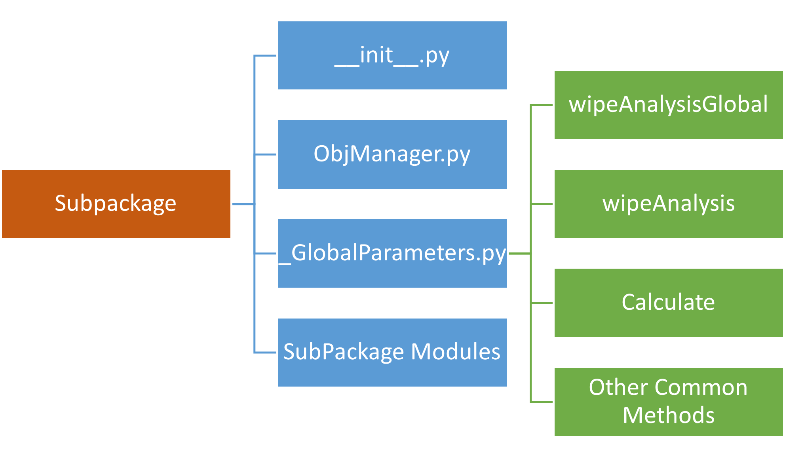

.. _Framework:

*******************
Framework Structure
*******************
|opr| framework consist of a collection of subpackages. There are two types of SubPackages, common subpackages and special subpackages. Special subpackages are the ones that are used for special purposes like Misc (That is for managing modules and special required commands like wipe), Plot and PostProcess that as are obvious from their name are for post processing activities (That maybe remove in future into another Package). Rest of the subpackages are common packages that have the following structure:

.. _SPKStrFig:

	**Fig.1 - A Subpackage content structure**

.. note::

   The **__init__.py** and **ObjManager.py** are constant modules that **should exist in any subpackages and should never change**! 
   

In the following parts of :ref:`Fig.1 <SPKStrFig>` is describing.

_GlobalParameters
^^^^^^^^^^^^^^^^^

Every subpackage as shown in :ref:`Fig.1 <SPKStrFig>` contains a **_GlobalParameters.py** file that involves variables and methods that are common for all classes inside the subpackage. It plays a key rule to make integrity between subpackage modules and specifies the minimum methods and variables and type of variables that each module should have.

It contains GlobalParameters class and all of the common variables and methods with no initial values and calculations are defined in this class and they show that subpackage modules should contain and fill these methods and variables.

      .. admonition:: Example:
   
         The `_GlobalParameters.py <https://github.com/OpenSRANE/OpenSRANE/blob/main/opensrane/OutFlowModel/_GlobalParameters.py>`_ file content of `OutFlowModel <https://github.com/OpenSRANE/OpenSRANE/blob/main/opensrane/OutFlowModel/>`_ subpackage has been shown as a sample in the following. 
         
         **Python Code**
         
         .. code-block:: python
         
            class _GlobalParameters():
    

                def __init__(self):
                    
                    self.wipeAnalysis()
	            
                def wipeAnalysisGlobal(self):    
                
                    self.t_release=None  #Time list of outFlow or release
                    
                    self.MassLiquidReleaseRate=None   #Mass Liquid Release rate in each step 
                    self.dMassLiquid_release=None     #Mass Liquid list of OutFlow Or release in each time step (Delta Mass)
                    self.TotalMassLiquid_Release=None #Total Mass Liquid list of OutFlow Or release in each time step
                    
                    self.MassGasReleaseRate=None      #Mass Gas Release rate in each step 
                    self.dMassGas_release=None        #Mass Gas list of OutFlow Or release in each time step (Delta Mass)
                    self.TotalMassGas_Release=None    #Total Mass Gas list of OutFlow Or release in each time step
                    
                    self.UnitObject=None
	            
                def wipeAnalysis(self):
                    self.wipeAnalysisGlobal()
                    pass          
                    

                def Calculate(self):
                    
                    UnitObject=self.UnitObject #self.UnitObject is defined in _GlobalParameters
                    if UnitObject==None:         
                        raise 'Error: self.UnitObject is emptey and before any usage it should be assigned before'
                    
                    return -1
					
         Variables like **MassLiquidReleaseRate, dMassLiquid_release, TotalMassLiquid_Release and ...** are the ones that every class of outflow subpackage should calculate and fill them. These variables in each analysis or sampling could varies depend on the verious conditions, so they should be reset at the start of each analysis. To get ensure these variables will be restart and the begining of the analysis, they are put in **wipeAnalysisGlobal(self)** that will be explained in related part. Also, there is a **Calculate(self)** method that all classes in the `OutFlowModel <https://github.com/OpenSRANE/OpenSRANE/blob/main/opensrane/OutFlowModel/>`_ subpackage, should have this method and calculate and return what is explained in its related discription in :ref:`outflow subpackage structure <OutFlowModelEx>` part.
                     

All classes in each subpackage should inherits _GlobalParameters class and initialize the _GlobalParameters variables and also fill them with the results or entered parameters by the user. Also, methods that should be common for all classes in the subpackage should be define in _GlobalParameters class. However, in any class the method code can changes by developer.

These parameters should be filled by each module and the results of calculations are stored in them. Each module can have their own internal methods and these methods are used only for internal calculations of the module and they won’t be call with other modules or subpackages. Sometimes there are some methods that maybe useful for subpackage modules so they are located in _GlobalParameters.py and started with “_” sign.

For some subpackages there are Calculate method in some _GlobalParameters.py is responsible to start module calculations to fill the parameters with results. So, the main code of the module should be written in the Calculate method and this part is called by analysis subpackage and after it, the parameters should be filled by the results.

Other Common Methods: there are some other methods in _GlobalParameters.py (That are not started with “_”) and also these methods should be considered with each module and the need of them are explained in each subpackage description in the following chapters.

wipeAnalysis and wipeAnalysisGlobal in _GlobalParameters.py are very important methods that show the common parameters that should filled with their initial value at the start of the analysis.